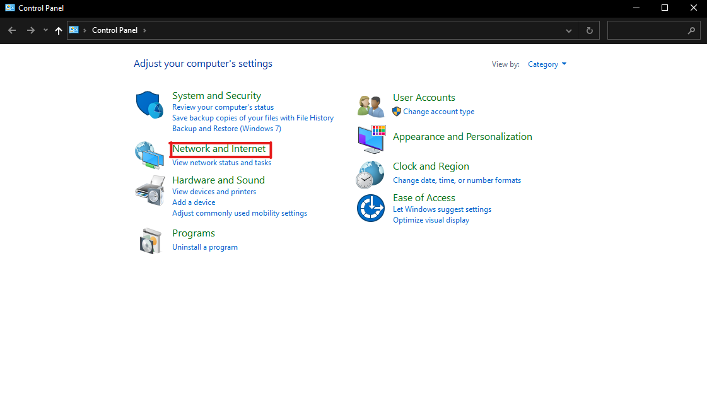
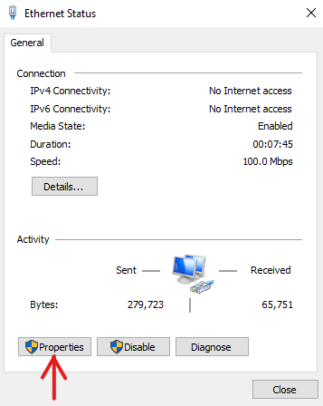

# Windows_DNS_Fixer

This is a small program which is used to Fix the "DNS Not Responding" Problem in  windows. They make look something like...

<div align="center">
  <br />
  
  <br />
  <br />
  
  <br />
</div>

## How to Fix it ?

- Well after checking all the hardware side problem like
  - Loose wire connection.
  - Any physical damage on the hardware devices and stuff.

- There are two ways to fix it.
  - The first method is to set the DNS server address manually.
  - The second one is to use some commands to fix this issue.

### Step 1 :

- Open up Control Panel
- Click on "Network and Internet"

<div align="center">
  <br />
  
  <br />
  <br />
</div>

- Click on "Network and Sharing Center"

<div align="center">
  <br />
  
  <br />
  <br />
</div>

- Click on the device casuing that problem.

<div align="center">
  <br />
  
  <br />
  <br />
</div>

- A dialog box named "Ethernet Status" will be opened.
- Click on the "Properties" Button.

<div align="center">
  <br />
  
  <br />
  <br />
</div>

- Another dialog box named "Ethernet Properties" will be opened.
- Double click on the option named "Internet Protocol Version 4 (TCP/IPv4)".

<div align="center">
  <br />
  
  <br />
  <br />
</div>

- Another dialog box named "Internet Protocol Version 4 (TCP/IPv4) Properties" will be opened.
- Choose the option Use the "following DNS server addresses".

<div align="center">
  <br />
  
  <br />
  <br />
</div>

- As soon as you select that option, it will enable two box which were not enable before.
- Now, we manually enter the DNS server addresses instead of the default ones.
- Set the Preferred DNS as ` 8 . 8 . 8 . 8 `.
- and the Alternative DNS as ` 8 . 8 . 4 . 4 `. *( Just as shown below )*

<div align="center">
  <br />
  
  <br />
  <br />
</div>

- Now Click "OK" to the all opened dialog boxes one after another.
- Close all the opened applications.
- And restart you system.

### Step 2 :

- Even after doing all the step mentioned above, if the problem is still not resolved then,
- You need to use the following execute the following commands in your Command Prompt.
- Some of these commands need Administrator level access.
- So, we have to run the CMD as Administrator and execute the following commands.
- The required commands are :

```cmd
ipconfig /flushdns
ipconfig /registerdns
ipconfig /release
ipconfig /renew
NETSH winsock reset catalog
NETSH int ipv4 reset reset.log
NETSH int ipv6 reset reset.log
```
- It may time to type and execute these commands, So I have made this program which execute all of these commands one after another.
- The program "[dns_fix.c](dns_fix.c "View the code of 'dns_fix.c'")" can be executed either in command line or either running it directly as an *.exe file.

> ****Note**** :
>
>> You need to run the CMD *( if you wish to run the 'dns_fix' in Command Line Interface )* or the *.exe *(if you wish to run it directly)* as `**Administrator**`.

- In the Command Line Interface, this programs allows some additional arguments. And they are :

##### 1) dns_fix -i

```cmd
C:\Users\user-name>dns_fix -i
 ```
 
 - By passing this argument, we can see the command we will get executed by this program to fix the DNS issue.

##### 2) dns_fix -y

```cmd
C:\Users\user-name>dns_fix -y
 ```
 
 - By passing this argument, we can execute the program without being asked whether the program is being exectued as Administrator or not.
 - It begins its execution by leaving a NOTE about the above point and executes.
 - If you are using this argument, then we assume that it is already running as Administrator.

##### 3) dns_fix -help

```cmd
C:\Users\user-name>dns_fix -help
 ```
 
 - This argument will display the documentation of this program.
 - It bascically contains the details like the version, requirements, description of the program and stuff.
 
 ##### 4) dns_fix -options

```cmd
C:\Users\user-name>dns_fix -options
 ```
 - This argument will display all possible argument that can be passes to this program.
 - It also contain the description of those arguments.

#### 5) dns_fix -version
 
```cmd
C:\Users\user-name>dns_fix -version
 ```
 
 - As the name of the argument suggest, it displays the version of the program.
 - If an update were meant to be addded, then the version of this program will be updated.
